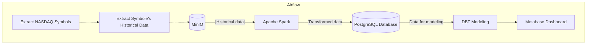
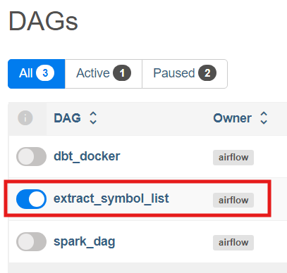
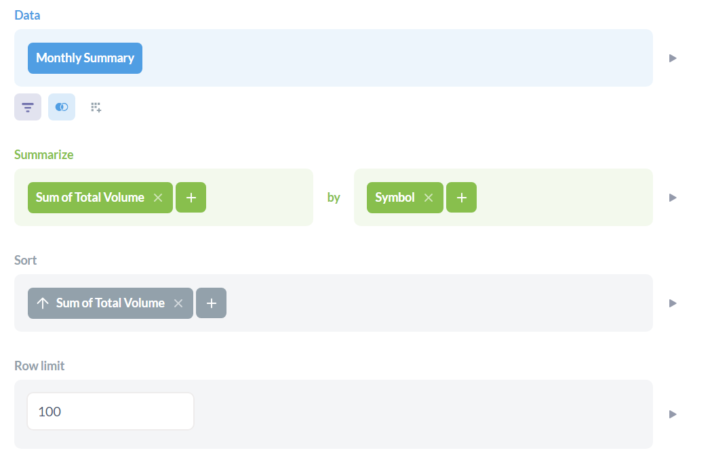
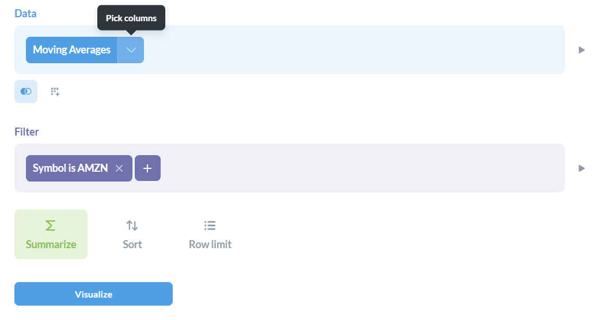
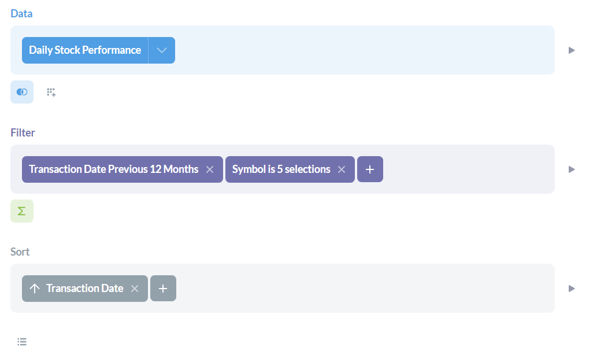
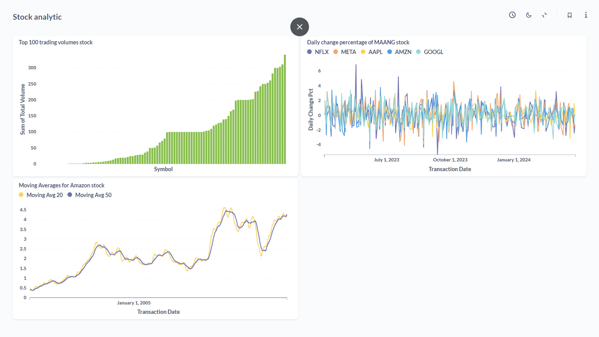

# Stock Market Data Pipeline
Data pipeline that extracts historical daily prices for all tickers currently trading on NASDAQ from the [Yahoo Finance API](https://finance.yahoo.com/) (via the [yfinance](https://pypi.org/project/yfinance/) library) using Python, Airflow, MinIO, Spark, PostgreSQL, dbt, Metabase all through Docker.

## Objective

This project create a pipeline that will extract all the symbols from NASDAQ and then download each symbol's daily historical prices from Yahoo Finance API and store them in a local datalake (which is compatible with Amazon S3) called [MinIO](https://min.io/), then using [Spark](https://spark.apache.org/) to load the data from the datalake to [Postgres](https://www.postgresql.org/) and create some models using [DBT](https://www.getdbt.com/). All the services is run through Docker's container which help the pipeline can be run on any machines and environments.

## Tools & Technologies

- Containerization - [**Docker**](https://www.docker.com), [**Docker Compose**](https://docs.docker.com/compose/)
- Datalake - [**MinIO**](https://min.io/)
- Orchestration - [**Airflow**](https://airflow.apache.org)
- Batch processing - [**Spark**](https://spark.apache.org/)
- Database - [**PostgreSQL**](https://www.postgresql.org/)
- Transformation, modeling - [**dbt**](https://www.getdbt.com)
- Data Visualization - [**Metabase**](https://www.metabase.com/)
- Language - [**Python**](https://www.python.org)

## Architecture



## Setup

### Prerequisite

- Docker
- Docker Compose

### Install

Every tools is installed through docker compose. You can find those in the [docker-compose.yml](./docker-compose.yml)

There are also separate docker compose files for [Airflow](./airflow-docker-compose.yml), [MinIO](./minio-docker-compose.yml), [Spark](./spark-docker-compose.yml), [PostgreSQL](./postgres-docker-compose.yml), [dbt](./dbt-docker-compose.yml). You can run each one with this command:

```
docker compose up --build -f airflow-docker-compose.yml
docker compose up -f minio-docker-compose.yml
docker compose up -f spark-docker-compose.yml
docker compose up -f postgres-docker-compose.yml
docker compose up --build -f dbt-docker-compose.yml
```

Before installing, you'll need to create a docker network first:

```
docker network create stock-market-network
```

Installation

```
docker compose up --build
```

To submit Spark job to Airflow, you'll need to create Spark connection for Airflow first.

```
docker compose run airflow-webserver airflow connections add 'spark_stock_market' --conn-type 'spark' --conn-host 'spark://spark-master-1:7077'
```

### Running

1. Open Airflow UI: `http://localhost:8080`

2. Run the `extracting_finanace_data` DAG in Airflow


3. Open Metabase: `http://localhost:3000`

Setup postgres connection in Metabase using environment variables from [postgres-docker-compose.yml](./postgres-docker-compose.yml)

Create these questions (using the public_stock_market schema):







## Dashboard


